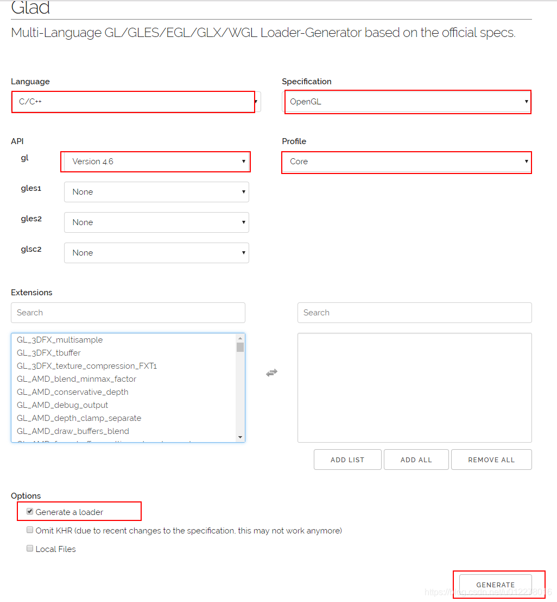
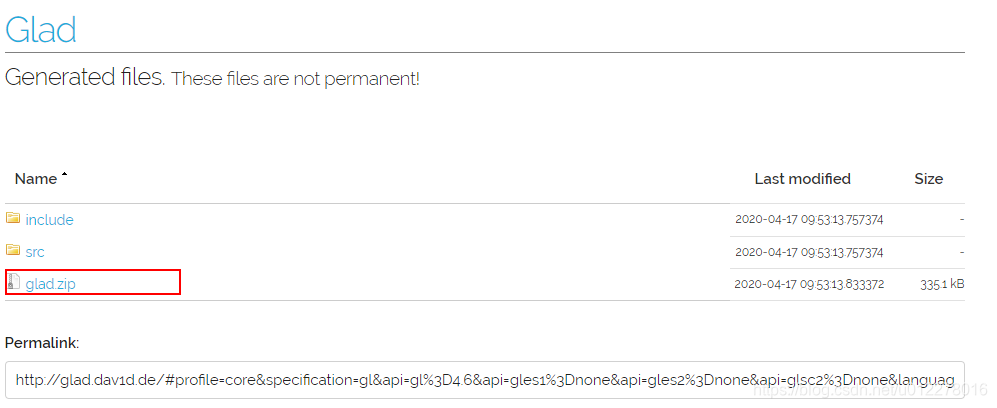

配环境真的很痛苦 (╥_╥)

# 需要的包？

1. GLFW（task1&task2&task3）
2. GLEW（task1&task2）
3. GLAD（task3）
4. glm（task3）

# 包的安装

## GLFW 与 GLEW

GLFW的[官网](https://www.glfw.org/)和[github仓库](https://github.com/glfw/glfw)

GLEW的[github仓库](https://github.com/nigels-com/glew)

在官网或者github仓库，下载预编译版本即可。应该是一个压缩包，里面存放着代码头文件以及库文件（.lib, .a, .dll等）。

## GLAD

GLAD是一个在线的OpenGL加载器生成器，可以根据需要生成适合特定OpenGL版本和功能的加载器代码。以下是使用GLAD的步骤：

1. 访问GLAD的官方网站：https://glad.dav1d.de/
2. 选择需要的OpenGL版本和功能。通常，选择最新的稳定版本和核心功能集。
3. 选择生成的语言（如C/C++）和加载器类型（如静态库或动态库）。
4. 点击“Generate”按钮，下载生成的GLAD代码包。

下载压缩包 glad.zip 后解压，得到的就是我们需要的 GLAD 代码文件夹，里面包含了头文件和源文件。

## glm

在[github仓库](https://github.com/g-truc/glm)中，点击release，下载最新版本的压缩包即可。解压后得到的文件夹中包含了glm的头文件。

# CMakeLists.txt 的配置

